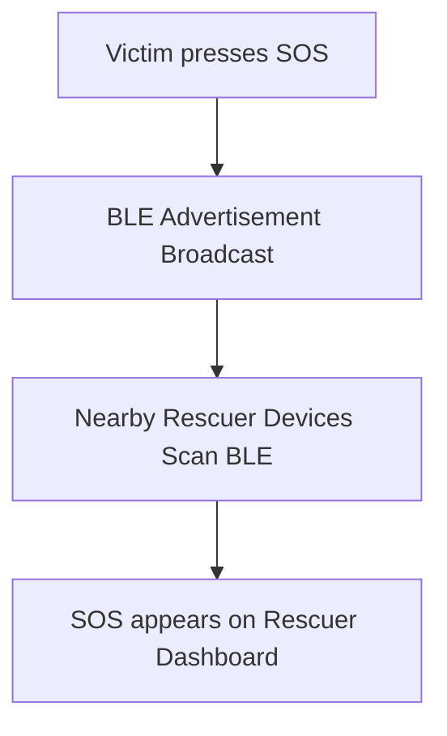
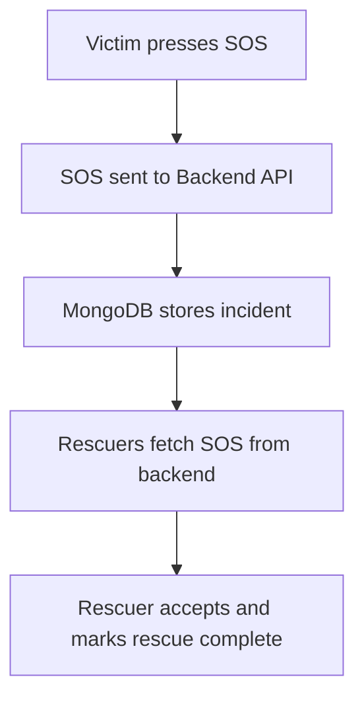

# HelpHop – Hybrid Online/Offline SOS Emergency System

HelpHop is a hybrid emergency communication system designed to send SOS alerts even when internet connectivity is unavailable. The system combines Bluetooth Low Energy (BLE)–based offline broadcasting with a backend-powered online coordination system, ensuring reliable emergency communication during disasters such as floods, earthquakes, fires, or landslides.

The application enables victims to broadcast SOS alerts while rescuers nearby can receive and respond to them. When internet connectivity is available, the backend server becomes the source of truth for SOS coordination and messaging.

---

## 🚀 Key Features

## 🔄 Hybrid Communication Model

The system automatically switches between two communication modes:

### 📡 Offline Mode
- SOS alerts are broadcast using Bluetooth Low Energy (BLE).
- Nearby devices can detect SOS signals without internet connectivity.

### 🌐 Online Mode
- SOS alerts are stored and coordinated via the backend server.
- Rescuers receive alerts through REST API calls.

---

## 🆘 Emergency SOS Broadcasting

Victims can send emergency alerts including:

- Emergency type (Fire, Flood, Earthquake, Landslide, etc.)
- GPS location
- Device ID
- Unique SOS ID

These alerts are broadcast using BLE advertisements.

---

## 🧑‍🚒 Rescuer Dashboard

Rescuers can:

- View incoming SOS alerts
- Identify emergency types
- See approximate locations
- Mark victims as rescued

---

## Project Architecture

The HelpHop system follows a hybrid architecture combining Bluetooth-based offline communication with a backend-powered online coordination system.

                 ┌─────────────────────┐
                 │   Victim Device     │
                 │  (Flutter App)     │
                 └─────────┬──────────┘
                           │
                           │ BLE Advertisement
                           ▼
                 ┌─────────────────────┐
                 │ Nearby Rescuer App  │
                 │ (BLE Scanner)       │
                 └─────────┬──────────┘
                           │
                           │ Internet Available
                           ▼
               ┌──────────────────────────┐
               │      Backend Server      │
               │  Node.js + Express API   │
               └─────────┬────────────────┘
                         │
                         ▼
                   ┌───────────┐
                   │ MongoDB   │
                   │ Database  │
                   └───────────┘

### 💡 Key Idea

- **Offline discovery →** Bluetooth Low Energy (BLE)  
- **Reliable coordination →** Backend server  
- **Persistent storage →** MongoDB  

---

## 🔄 System Workflow

The system automatically switches between offline and online communication modes depending on network availability.

---

### 📡 Offline SOS Flow



---

### 🌐 Online SOS Flow


## Screenshots


---

## ⚙️ Installation Guide

### 📌 Prerequisites

Ensure the following software is installed:

- Flutter SDK  
- Node.js (v16 or later)  
- MongoDB (Local installation or MongoDB Atlas)  
- Git  
- Android Studio or VS Code  

Verify Flutter installation:

```bash
flutter doctor
```

---

## 📱 Running the Mobile Application

### Step 1: Navigate to the Flutter project

```bash
cd help_hop-main
```

### Step 2: Install dependencies

```bash
flutter pub get
```

### Step 3: Run the application

```bash
flutter run
```

---

### ⚠️ Important

Make sure:

- ✅ Bluetooth is enabled  
- ✅ Location services are enabled  
- ✅ Location permission is granted to the app  
- ✅ The device is running Android  
- ✅ Developer mode is enabled  

---

## 🖥 Running the Backend Server

### Step 1: Install backend dependencies

Run the following commands in each backend module:

```bash
cd helphop_backend
npm install

cd ../helphop_personB_backend-main
npm install

cd ../helphop-backend-personA-main
npm install

cd ../personC_crypto_alerts
npm install
```

---

### Step 2: Start MongoDB

Start MongoDB locally:

```bash
mongod
```

Or connect to MongoDB Atlas using your configured connection string.

---

### Step 3: Start the backend server

Navigate to the main backend folder:

```bash
cd helphop_backend
npm start
```

You should see:

```
MongoDB connected
Server running on port 3000
```

---

## 🧪 Testing the System

### 📡 Offline Mode

1. Disable Wi-Fi and mobile data.
2. Send an SOS alert from the victim device.
3. Nearby devices detect the SOS using BLE scanning.

---

### 🌐 Online Mode

1. Enable internet connection.
2. Send an SOS alert.
3. The backend stores and distributes the alert to rescuers.

---

## 🌟 Project Highlights

- ✅ Hybrid Online + Offline emergency communication  
- ✅ BLE-based internet-independent SOS alerts  
- ✅ Real-time rescuer dashboard  
- ✅ Duplicate SOS prevention logic  
- ✅ Secure API with JWT authentication  
- ✅ Designed for disaster response scenarios  

---
